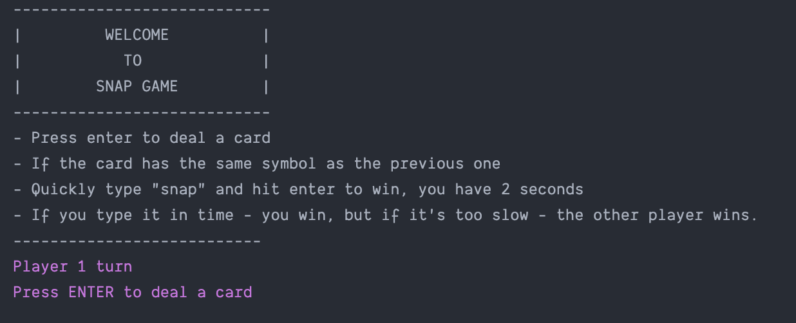

  

<h3 align="center">Snap Game</h3>

---

 Simple Snap Card game played in console.
      

## 📝 Table of Contents

- [About](#about)
- [Getting Started](#getting_started)
- [Usage](#usage)
- [Built Using](#built_using)
- [Authors](#authors)
- [Notes](#notes)

## 🧐 About 

Simple Snap card game, made in Java, played in console. Playing snap is pretty simple, each time the new card is the same
as the last one, person drawing a card needs to say (in case of this version write) a word "SNAP", to win.

## 🏁 Getting Started 

To play the game, the repo has to be downloaded, and opened with any IDE, for example IntelliJ. Once it is open it can be
played by using "Run" button on the Main class.

## 🎈 Usage 

- Press "Run" button on the Main class to start the game.
- Once the game is started it will display the instructions how to play.
- Press enter to draw a card - each player has its own color - Player 1 has purple, player 2 has yellow.
- Play until the drawn card is the same symbol (Aces to Kings) as the previous one.
- To win the game, type "snap" within 2 seconds and press enter.
- If none/wrong word is entered, the opponent wins.
- To play again run the file again.

## ⛏️ Built Using 

Java, OOP

## ✍️ Authors 

- [@DorBia](https://github.com/dorbia)

## 📌 Notes 

I have created a DeckOfCards class rather than CardGame class, because I felt it was better thing to do, as every card
game will be based on dealing with a deck of cards, and not on the "card game" itself. So creating a deck of cads, and
dealing with them, seems like a job for the deck of cards. Each deck can be shuffled, from each deck card can be dealt, 
etc. I have additionally created a Display class to display instructions, end game message, and prompt to draw a card. 
